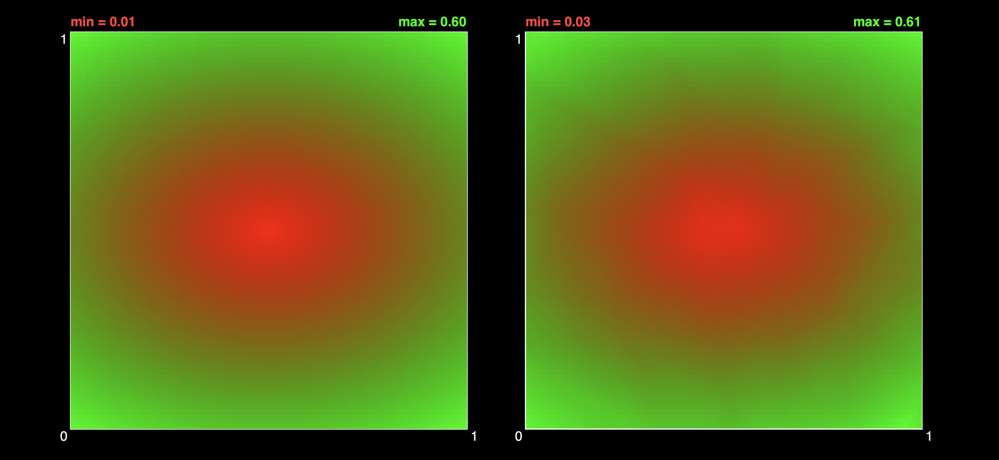
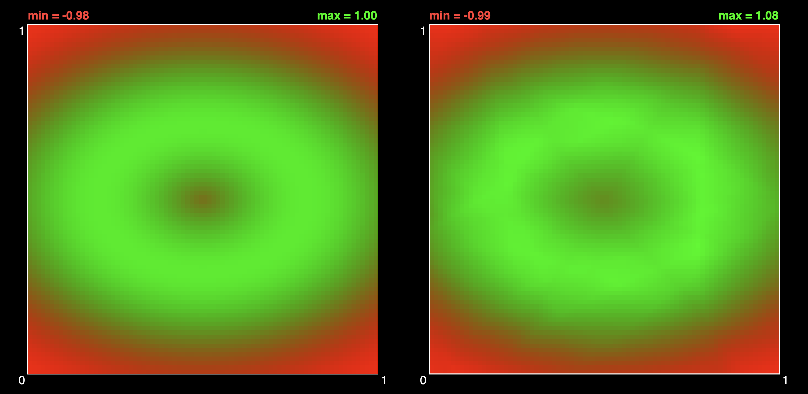
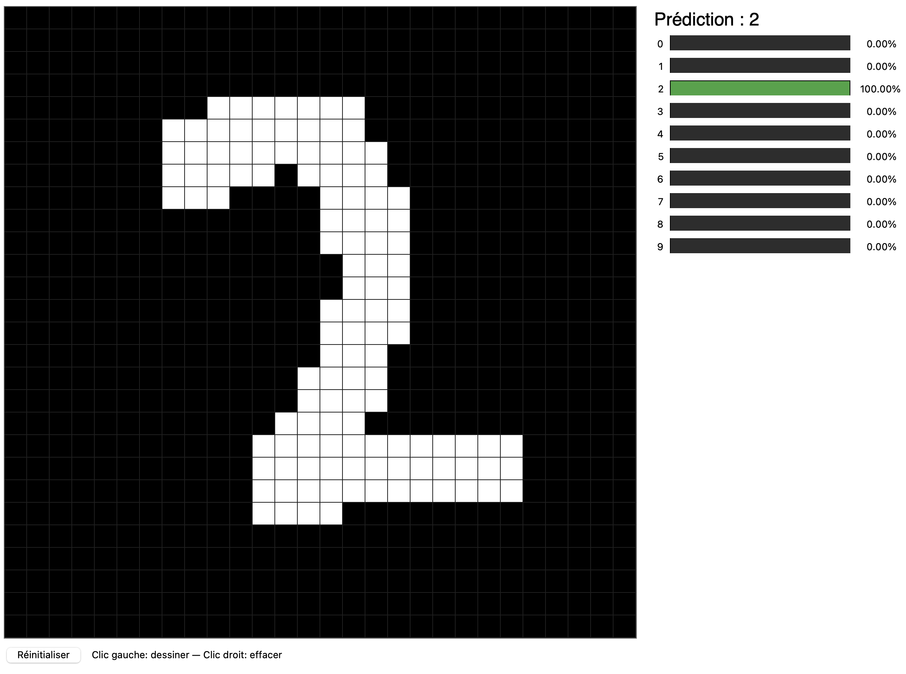
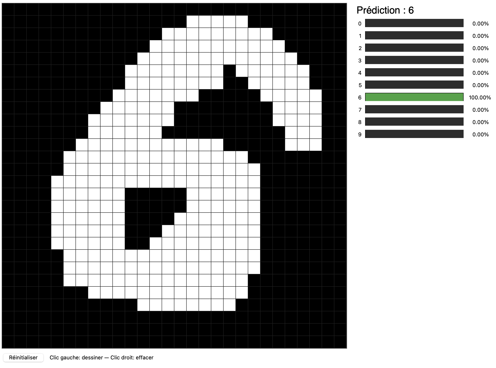
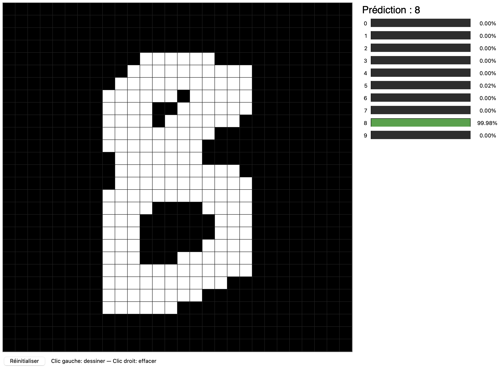
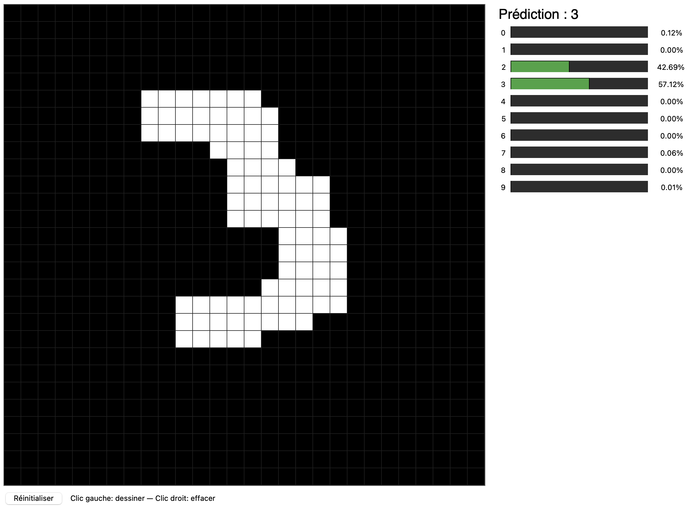

# Neural Network

This program showcases a general neural network built from scratch, and exposes by default several scripts showing off incredible performances in number recognition and shape learning.

# Examples

## Shape learning

>   
> *Example of a model trained to reproduce the shape on the left square, we can clearly see the model's approximation on the right, which was learnt during its training*

>   
> *Same thing with a more complex shape*

## Number recognition

>   
> *The number 2*

>   
> *The number 6*

>   
> *The number 8*

>   
> *The number 3, but it is not well drawn so the model hesitates with a 2*
